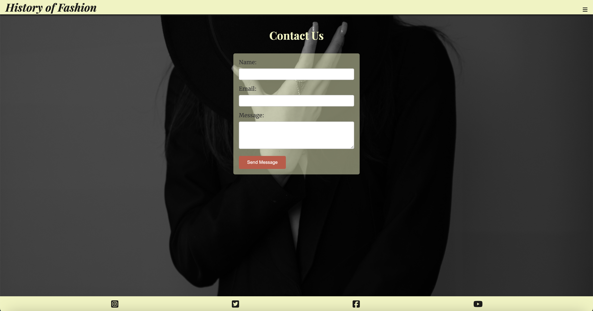
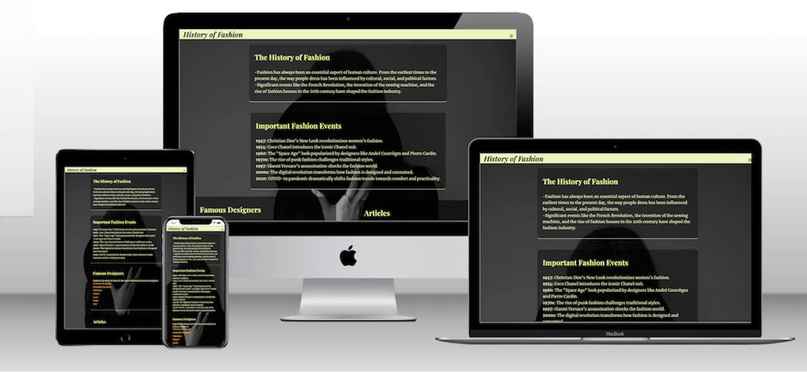

# History of Fashion

### Table of Contents

1. [Project Overview](#project-overview)
2. [Features](#features)
   - [Home Page](#home-page)
   - [Gallery Page](#gallery-page)
   - [Contact Page](#contact-page)
3. [User Experience (UX)](#user-experience-ux)
   - [User Stories](#user-stories)
   - [Design](#design)
     - [Colour Scheme](#colour-scheme)
     - [Typography](#typography)
     - [Imagery](#imagery)
     - [Wireframes](#wireframes)
4. [Technologies Used](#technologies-used)
5. [Testing](#testing)
   - [HTML Validation](#html-validation)
   - [CSS Validation](#css-validation)
   - [Responsiveness](#responsiveness)
   - [Browser Compatibility](#browser-compatibility)
   - [Accessibility](#accessibility)
   - [Performance](#performance)
   - [Link Testing](#link-testing)
   - [Form Validation](#form-validation)
6. [Deployment](#deployment)
7. [Credits](#credits)
8. [Acknowledgements](#acknowledgements)

---

### Project Overview

The History of Fashion website is designed to educate users about the evolution of fashion through different eras, highlight significant fashion events, showcase influential designers and provide curated articles and quotes on fashion. It features a mobile-first responsive design to ensure accessibility and a smooth user experience across various devices.

### Features

#### Home Page

- **Responsive Navbar**: A toggle navigation menu for easy access to different pages.
- **Hero Section**: A visually appealing introduction with background images and descriptive text.
- **Informative Content Sections**:
  - **History of Fashion**: Information about the evolution of fashion across different eras.
  - **Important Fashion Events**: Highlights events that have shaped the fashion industry.
  - **Famous Designers**: Lists influential designers with links to their official websites.
  - **Articles**: A section dedicated to articles about various fashion topics.
  - **Famous Quotes**: Inspirational quotes related to fashion and style.
- **Social Media Links**: Icons with links to relevant social media platforms.

#### Gallery Page

- **Gallery Section**: Displays a grid of images showcasing fashion icons like [Vivienne Westwood](https://www.viviennewestwood.com/), [Coco Chanel](https://www.chanel.com/), [Christian Dior](https://www.dior.com/) and others.

#### Contact Page

- **Contact Form**: A simple form that allows users to send inquiries or messages.

**Navigation bar**:

- The navigation bar is available on all three pages and includes links to Logo, Home, Gallery and Contact pages. It's the same on every page, making it easy for users to move between pages on any device without needing to use the back button.

**Footer**:

- The footer includes four social media icons (Instagram, Twitter, Facebook, Youtube) that opens in new tabs, maintaining a clean, minimal design with a light background.

---

### User Experience (UX)

#### User Stories

1. As a user, I want to learn about the different eras of fashion, understanding how fashion has evolved over time.
2. As a visitor, I want to view a gallery of images, read articles, and explore fashion trends.
3. As an enthusiast, I want to read famous quotes and contact for more information or newsletters through the contact form.

#### Design

##### Colour Scheme

- Primary Colours: A soft cream (#eff3bd) and coral (#ffb347) to create a vintage feel.

- Accent Colours: A darker shade (#161616f8) for text to ensure readability.

##### Typography

- Body Text: ‘Merriweather’, sans-serif - Designed and pleasant for on-screen reading.
- Headings: ‘Playfair Display’, sans-serif - For the high contrast between its thick and thin lines.

##### Imagery

- Large, high-quality images are used throughout to engage users visually.

##### Wireframes

![screenshots]

---

### Technologies Used

- HTML5: For structure and content.
- CSS3: For styling and responsive design.
- Font Awesome: For icons used in the social media links.
- Google Fonts: For typography.
- Pexels and Unsplash: For images.
- TinyPNG: For optimizing the images.

---

### Testing

#### HTML Validation

The HTML pages were tested using the [W3C HTML5 Validator](https://validator.w3.org/) and passed with no errors. 

Home Page HTML validation screenshot:

Gallery Page HTML validation screenshot:

Contact Page HTML validation screenshot:

404 Page HTML validation screenshot:

#### CSS Validation

The CSS was tested using the [W3C CSS Validator](https://jigsaw.w3.org/css-validator/) and passed with no errors.

CSS validation screenshot:

#### Responsiveness

Tested across multiple devices and screen sizes, including tablets, and desktops.

#### Browser Compatibility

The website was tested on different browsers (Chrome, Firefox, and Safari) to ensure compatibility.

#### Accessibility

The website was tested using Lighthouse [PageSpeed Insights](https://pagespeed.web.dev/) to ensure accessibility. It achieved high scores of 100 for Accessibility, Best Practices and SEO.

 - Mobile:

 
 
 

 -  Desktop:

 
  
 

#### Performance

The images were optimized using [TinyPNG](https://tinypng.com/) and Lighthouse reports were run to check the load time.

#### Link Testing

All internal and external links were tested to ensure they direct to the correct page and open in new tabs.

#### Form Validation

The Contact form was tested for proper validation to ensure all required fields are completed before submission.

|  | |  |

---

### Deployment

The project was deployed using GitHub Pages. [https://raulcraciun93.github.io/History-of-Fashion/](https://raulcraciun93.github.io/History-of-Fashion/)

To deploy this project:
1. Navigate to your GitHub repository.
2. Go to the "Settings" tab.
3. Scroll down to the "GitHub Pages" section.
4. Under "Source", select the main branch and click "Save".
5. Your project will be published on Github Pages. 

---

### Credits

- **Content**: Information about the history of fashion was sourced from websites like [Wikipedia](https://www.wikipedia.org/) and other fashion websites.
- **Images**: All images used in the project are from [Unsplash](https://unsplash.com/) and [Pexels](https://www.pexels.com/), a source of free high-resolution photos.
- **Quotes and Articles**: From various fashion blogs.
- **Code Inspiration**: Various design and functionality ideas were inspired by tutorials from the [Code Institute](https://codeinstitute.net/) course and web development resources like [MDN Web Docs](https://developer.mozilla.org/en-US/).
- **Footer Icons**: [FontAwesome](https://fontawesome.com/).
- **Fonts**: [Google Fonts](https://fonts.google.com/).

---

### Acknowledgements

- I would like to thank my mentor Rory and Code Institute for providing guidance and resources for this project.